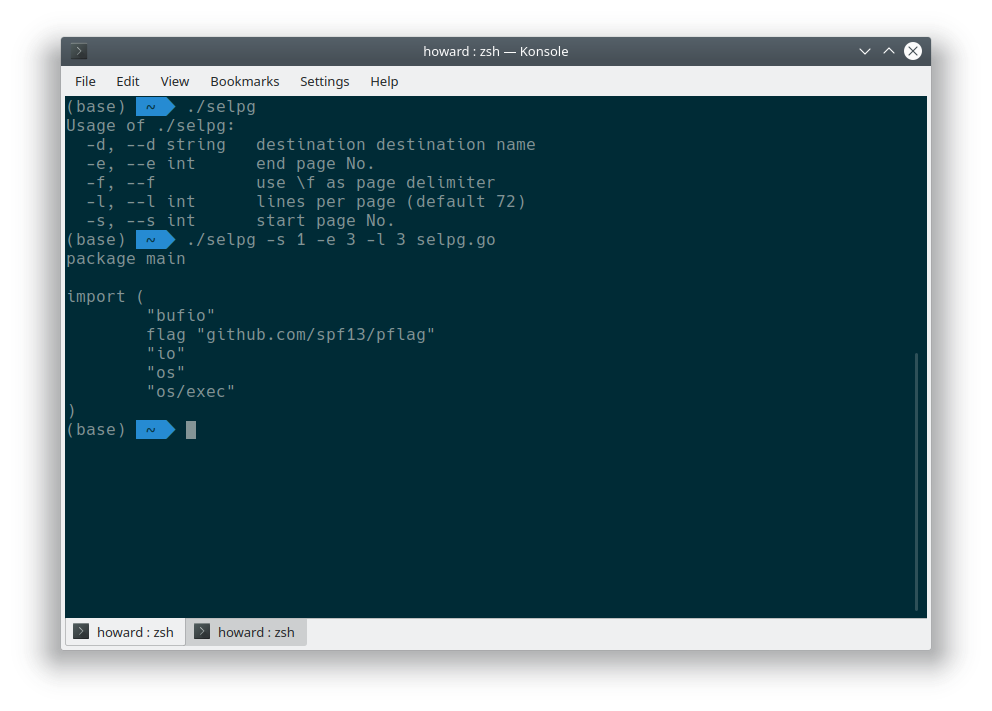
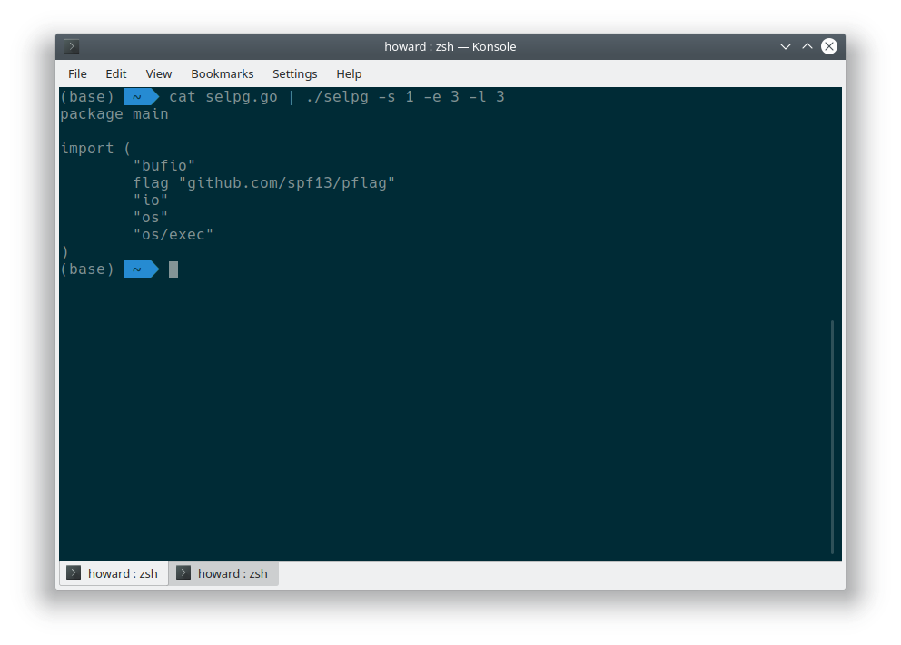

# `selpg` utility

This small go program rewrites `selpg` ([https://www.ibm.com/developerworks/cn/linux/shell/clutil/index.html](https://www.ibm.com/developerworks/cn/linux/shell/clutil/index.html)) in golang.

## Design

This small program firstly parses the command line flags and arguments, then outputs the selected pages from input to stdout or a `lp` command. 

In line seperated mode, the program iterates all the lines in the input and bump a line counter. When the line counter reaches the limit of one page, the program bumps the page counter. In `\f` seperated mode, the program iterates all bytes and bumps the page counter when encountering a `\f` ascii control character.

The program will output only if the page counter is within the range specified by the command line flags. Once exceeded, the program finishes output and exits.

## Usage

```selpg -s 1 -e 10 [-l 10] [-f] [-d lp1] [filename]```

Flags:
- `-s` start page No.
- `-e` end page No.
- `-f` use `\f` as page delimiter
- `-l` specifies lines in one page
- `-d` output destination for `lp -ddestination` command
- `filename` optional filename argument, stdin if not specified

## Screenshots



